<div align="center">

# Azure Resource Inventory (ARI)


### A powerful PowerShell module for generating comprehensive Azure environment reports

[](https://github.com/microsoft/ARI/blob/main/LICENSE)
[](https://github.com/microsoft/ARI)
[](https://github.com/microsoft/ARI/commits/main)
[](https://github.com/microsoft/ARI)
[](https://azure.microsoft.com)

</div>

## 📋 Table of Contents

- [Overview](#-overview)
- [Key Features](#-key-features)
- [Getting Started](#-getting-started)
  - [Prerequisites](#prerequisites)
  - [Installation](#installation)
  - [Quick Start](#quick-start)
- [Container Deployment](#-container-deployment)
- [Usage Guide](#-usage-guide)
  - [Basic Commands](#basic-commands)
  - [Common Scenarios](#common-scenarios)
- [Parameters Reference](#-parameters-reference)
- [Output Examples](#-output-examples)
  - [Excel Report](#excel-report)
  - [Network Topology View](#network-topology-view)
  - [Organization View](#organization-view)
  - [Resources View](#resources-view)
- [Important Notes](#-important-notes)
- [Authors & Acknowledgments](#-authors--acknowledgments)
- [Contributing](#-contributing)
- [License](#-license)

## 🔍 Overview

Azure Resource Inventory (ARI) is a comprehensive PowerShell module that generates detailed Excel reports of any Azure environment you have read access to. It is designed for Cloud Administrators and technical professionals who need an easy and fast way to document their Azure environments.

<p align="center">
  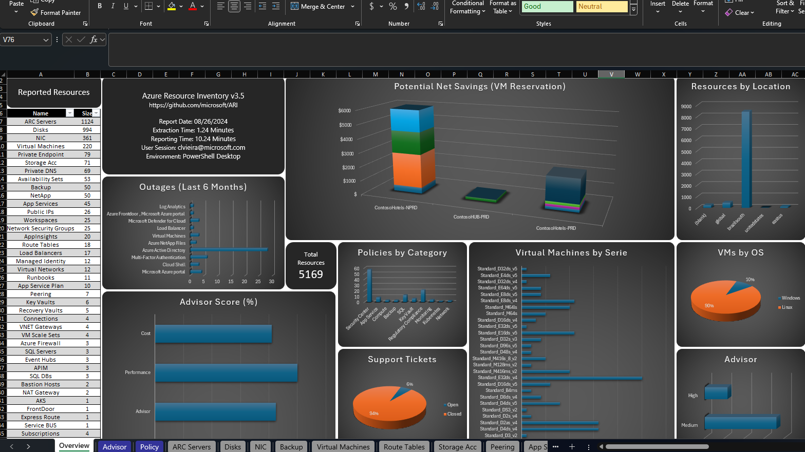
</p>

## ✨ Key Features

- **Complete Resource Documentation**: Detailed inventory of all Azure resources
- **Interactive Excel Reports**: Well-formatted spreadsheets with resources organized by type
- **Visual Network Diagrams**: Generate interactive topology maps of your Azure environment
- **Security Analysis**: Integration with Azure Security Center (optional)
- **Cross-Platform Support**: Works on Windows, Linux, Mac, and Azure Cloud Shell
- **Automation-Ready**: Can be deployed via Azure Automation Accounts
- **Low-Impact**: Read-only operations with no changes to your environment


## 🚀 Getting Started

### Prerequisites

- PowerShell 7.0+ (recommended) or PowerShell 5.1
- Azure Account with read access to resources you want to inventory
- Administrator privileges during script execution (for module installation)

### Installation

Install the module directly from PowerShell Gallery:

```powershell
Install-Module -Name AzureResourceInventory
```

<p align="center">
  
</p>


### Quick Start

To generate a basic inventory report:

```powershell
Import-Module AzureResourceInventory
```

<p align="center">
  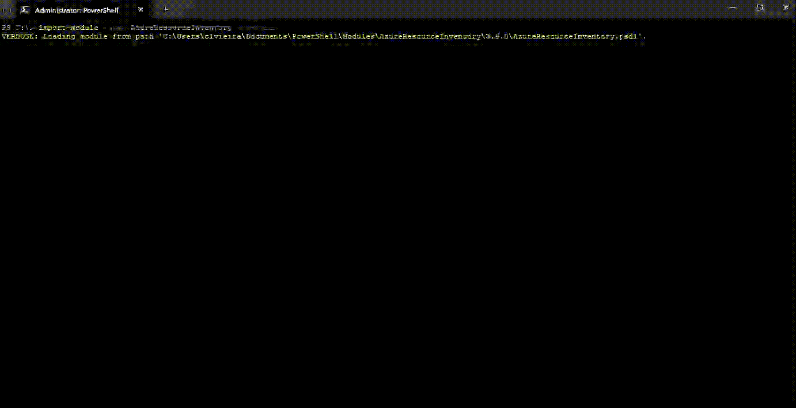
</p>


```powershell
Invoke-ARI
```

<p align="center">
  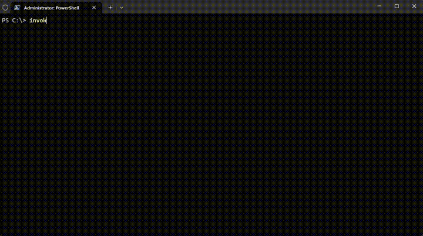
</p>

## 🐳 Container Deployment

For deploying ARI as a containerized web application with Azure File Share integration, see the [Container Deployment Guide](CONTAINER-DEPLOYMENT.md).

**Key Features:**
- 🧹 **Automatic File Share Cleanup** - Clears Azure File Share before each run
- 📊 **Diagram Generation & Validation** - Enabled by default with post-run validation
- 🔄 **Persistent Storage** - Azure File Share integration for report persistence
- 🌐 **Web Interface** - User-friendly interface with device login authentication

### 🧹 Automatic File Share Cleanup

When deploying as a container with Azure File Share integration, ARI includes enhanced automatic cleanup functionality to ensure a fresh state before each execution.

**How It Works:**

1. **Pre-flight Validation**: Tests connectivity, credentials, and file share accessibility
2. **Protected Item Detection**: Identifies system folders and files to preserve
3. **Recursive Deletion**: All non-protected files and directories are deleted
4. **Retry Logic**: Up to 3 attempts with 2-second delays for transient failures
5. **Verification**: Confirms only protected items remain after cleanup
6. **Blocking on Failure**: If cleanup fails, ARI execution is **blocked** to prevent data integrity issues

**Configuration:**

Set these environment variables in your container to enable cleanup:

```bash
AZURE_STORAGE_ACCOUNT=mystorageaccount
AZURE_STORAGE_KEY=<your-storage-key>
AZURE_FILE_SHARE=ari-data
```

**Behavior:**

- ✅ **Cleanup succeeds**: ARI execution proceeds normally
- ❌ **Cleanup fails**: ARI execution is **blocked** with detailed error message and troubleshooting steps
- ⚠️ **Not configured**: Cleanup is skipped, ARI proceeds (old files may accumulate)

**Protected Items:**

The following folders and files are **never deleted**:
- `.jobs` - Job persistence directory for workflow state
- `.snapshots` - Azure Files snapshot directory
- `$logs` - Azure Storage logs directory
- `System Volume Information` - Windows system folder
- `*.lock` - Lock files indicating active processes
- `*.tmp` - Temporary files that may be in use
- `.gitkeep` - Placeholder files for empty directories

**Enhanced Logging:**

All cleanup operations include structured logging with timestamps:
- Pre-flight validation results
- Items discovered and categorized (protected vs. deletable)
- Deletion attempts with retry information
- Final statistics (total, deleted, protected, failed, duration)
- Verification results
- Detailed error messages with troubleshooting steps

**Quick Troubleshooting:**

If cleanup fails, the error message includes specific guidance. Common issues:
1. **Authentication**: Verify storage account key hasn't been rotated
2. **Network**: Check firewall rules allow container access
3. **Permissions**: Ensure sufficient permissions on storage account
4. **Locked Files**: Check for concurrent access to file share

**Detailed Documentation:**

- 📖 [Complete Cleanup Guide](docs/AZURE-FILESHARE-CLEANUP.md) - Configuration, features, testing procedures
- 🔧 [Troubleshooting Guide](docs/CLEANUP-TROUBLESHOOTING.md) - Detailed error scenarios and resolutions

See the [Container Deployment Guide](CONTAINER-DEPLOYMENT.md) for setup instructions.

## 📖 Usage Guide

### Basic Commands

Run ARI with specific tenant:

```powershell
Invoke-ARI -TenantID <Azure-Tenant-ID>
```

Scope to specific subscription:

```powershell
Invoke-ARI -TenantID <Azure-Tenant-ID> -SubscriptionID <Subscription-ID>
```

Include resource tags in the report:

```powershell
Invoke-ARI -TenantID <Azure-Tenant-ID> -IncludeTags
```

### Common Scenarios

**Run in Azure Cloud Shell:**

```powershell
Invoke-ARI -Debug
```

**Include Security Center Data:**

```powershell
Invoke-ARI -TenantID <Azure-Tenant-ID> -SubscriptionID <Subscription-ID> -SecurityCenter
```

**Skip Azure Advisor Data Collection:**

```powershell
Invoke-ARI -TenantID <Azure-Tenant-ID> -SubscriptionID <Subscription-ID> -SkipAdvisory
```

**Skip Network Diagram Generation:**

```powershell
Invoke-ARI -TenantID <Azure-Tenant-ID> -SkipDiagram
```

### Automation Account Integration

If you want to automatically run ARI, there is a way to do it using Automation Accounts:

<p align="center">
  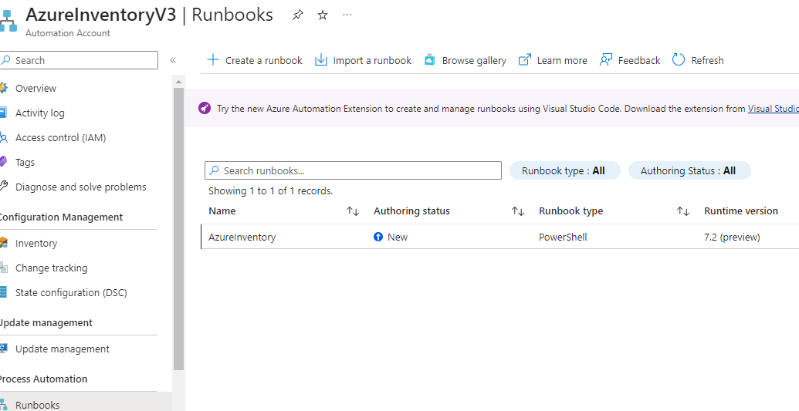
</p>

See the [Automation Guide](https://github.com/microsoft/ARI/blob/main/docs/advanced/automation.md) for implementation details.

## 📝 Parameters Reference

| Parameter | Description | Usage |
|-----------|-------------|-------|
| **Core Parameters** | | |
| TenantID | Specify the tenant ID for inventory | `-TenantID <ID>` |
| SubscriptionID | Specify subscription(s) to inventory | `-SubscriptionID <ID>` |
| ResourceGroup | Limit inventory to specific resource group(s) | `-ResourceGroup <NAME>` |
| **Authentication** | | |
| AppId | Application ID for service principal auth | `-AppId <ID>` |
| Secret | Secret for service principal authentication | `-Secret <VALUE>` |
| CertificatePath | Certificate path for service principal | `-CertificatePath <PATH>` |
| DeviceLogin | Use device login authentication | `-DeviceLogin` |
| **Scope Control** | | |
| ManagementGroup | Inventory all subscriptions in management group | `-ManagementGroup <ID>` |
| TagKey | Filter resources by tag key | `-TagKey <NAME>` |
| TagValue | Filter resources by tag value | `-TagValue <NAME>` |
| **Content Options** | | |
| SecurityCenter | Include Security Center data | `-SecurityCenter` |
| IncludeTags | Include resource tags | `-IncludeTags` |
| SkipPolicy | Skip Azure Policy collection | `-SkipPolicy` |
| SkipVMDetails | Skip Azure VM Extra Details collection | `-SkipVMDetails` |
| SkipAdvisory | Skip Azure Advisory collection | `-SkipAdvisory` |
| IncludeCosts | Includes Azure Cost details for the Subscriptions (Requires the module Az.CostManagement) | `-IncludeCosts` |
| SkipVMDetails | Skip extra details for the VM Families (Quota, vCPUs and memory) | `-SkipVMDetails` |
| **Output Options** | | |
| ReportName | Custom report filename | `-ReportName <NAME>` |
| ReportDir | Custom directory for report | `-ReportDir "<Path>"` |
| Lite | Use lightweight Excel generation (no charts) | `-Lite` |
| **Diagram Options** | | |
| SkipDiagram | Skip diagram creation | `-SkipDiagram` |
| DiagramFullEnvironment | Include all network components in diagram | `-DiagramFullEnvironment` |
| **Other Options** | | |
| Debug | Run in debug mode | `-Debug` |
| NoAutoUpdate | Skip the auto update of the ARI Module | `-NoAutoUpdate` |
| AzureEnvironment | Specify Azure cloud environment | `-AzureEnvironment <NAME>` |
| Automation | Run using Automation Account | `-Automation` |
| StorageAccount | Storage account for automation output | `-StorageAccount <NAME>` |
| StorageContainer | Storage container for automation output | `-StorageContainer <NAME>` |

## 📊 Output Examples

### Excel Report

<p align="center">
  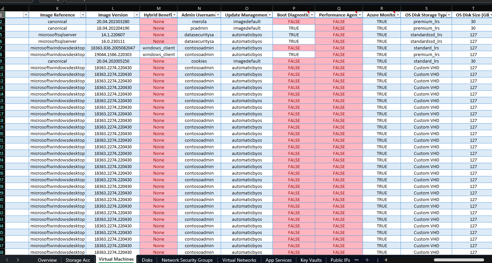
</p>

### Network Topology View

<p align="center">
  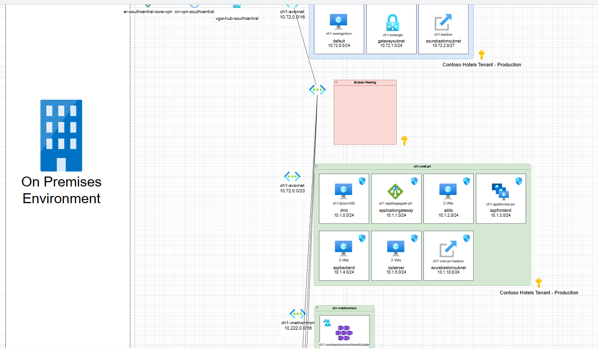
</p>

Interactive features show resource details on hover:

<p align="center">
  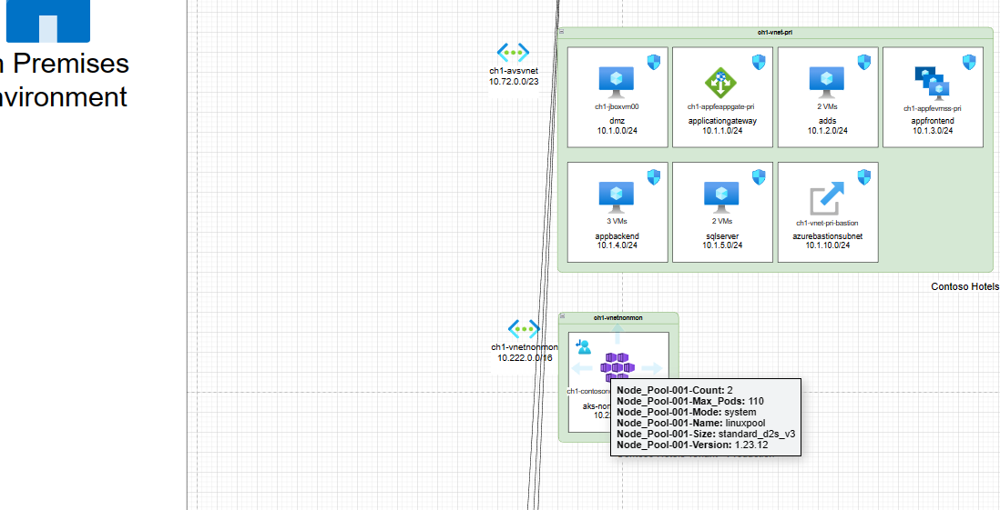
  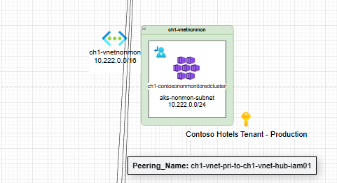
</p>

### Organization View

<p align="center">
  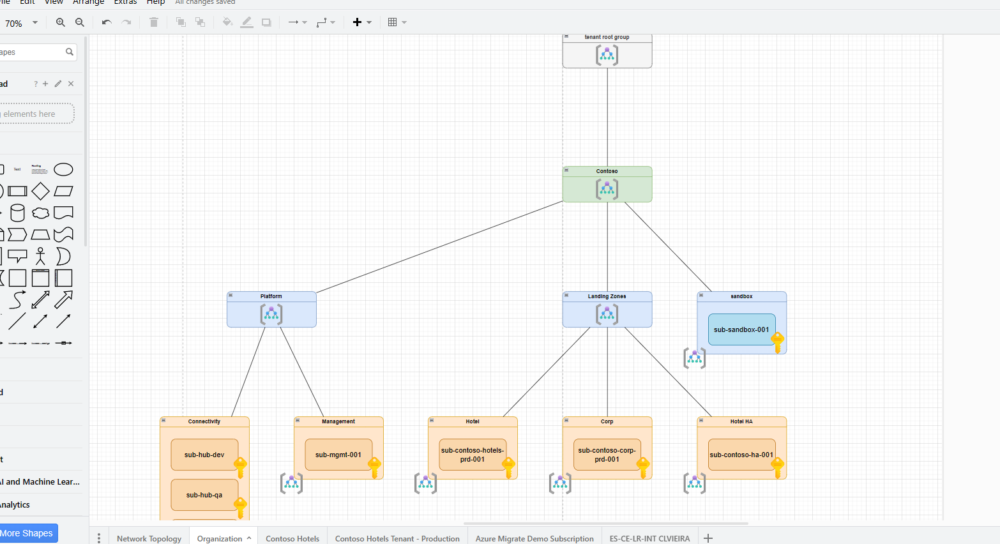
</p>

### Resources View

<p align="center">
  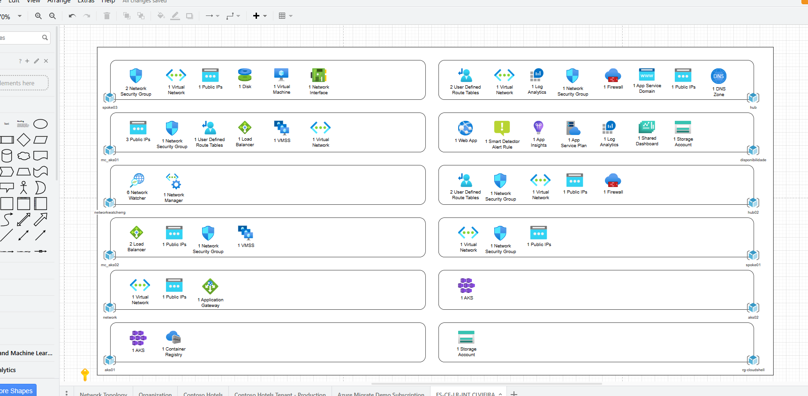
</p>

## ⚠️ Important Notes

> **Very Important:** ARI will not upgrade existing PowerShell modules. Ensure you have the required modules installed.

> **CloudShell Limitation:** When running in Azure CloudShell, the Excel output will not have auto-fit columns and you may see warnings during execution. The inventory results will still be correct.

<p align="center">
  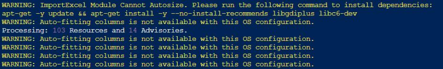
</p>

### Our Test Environment

| Tool | Version |
|------|---------|
| Windows | 11 22H2 |
| PowerShell | 7.4.4 |

### Output Details

- Default output location:
  - Windows: `C:\AzureResourceInventory\`
  - Linux/CloudShell: `$HOME/AzureResourceInventory/`
- Output filename format: `AzureResourceInventory_Report_yyyy-MM-dd_HH_mm.xlsx`
- Diagram filename format: `AzureResourceInventory_Diagram_yyyy-MM-dd_HH_mm.xml` (Draw.io format)

## 👥 Authors & Acknowledgments

- **Claudio Merola** (<claudio.merola@microsoft.com>)
- **Renato Gregio**

Special thanks to **Doug Finke**, the author of PowerShell [ImportExcel](https://github.com/dfinke/ImportExcel) module.

## 🤝 Contributing

Please read our [CONTRIBUTING.md](CONTRIBUTING.md) which outlines all policies, procedures, and requirements for contributing to this project.

## 📜 License

Copyright (c) 2025 Microsoft Corporation. All rights reserved.

Licensed under the MIT License - see the [LICENSE](LICENSE) file for details.

---

This project may contain trademarks or logos for projects, products, or services. Authorized use of Microsoft trademarks or logos is subject to and must follow [Microsoft's Trademark & Brand Guidelines](https://www.microsoft.com/en-us/legal/intellectualproperty/trademarks). Use of Microsoft trademarks or logos in modified versions of this project must not cause confusion or imply Microsoft sponsorship. Any use of third-party trademarks or logos are subject to those third-party's policies.
